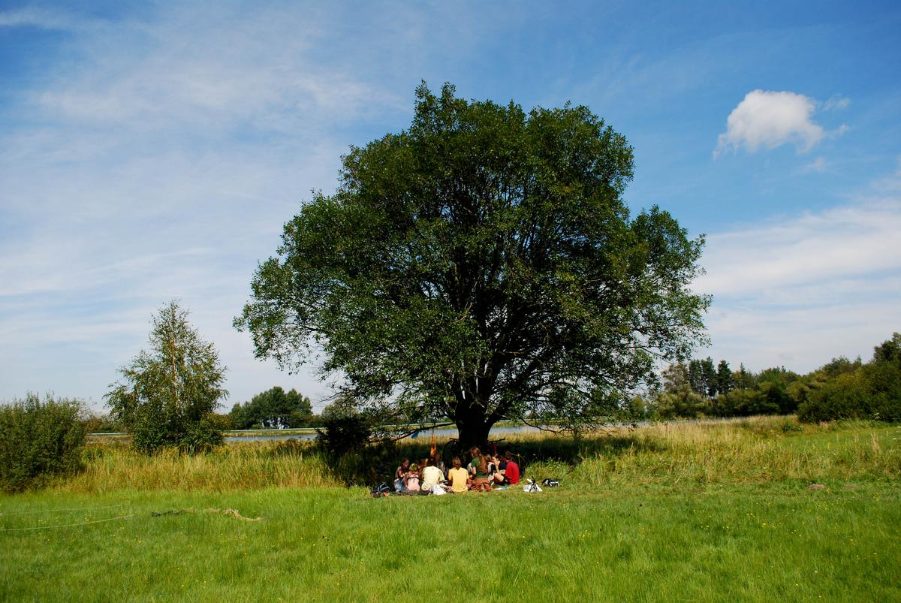
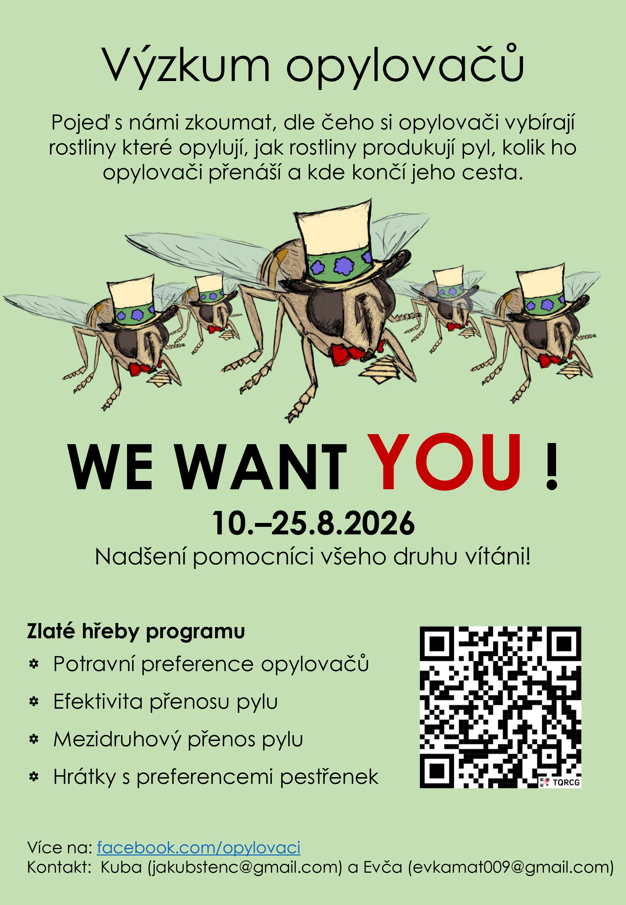
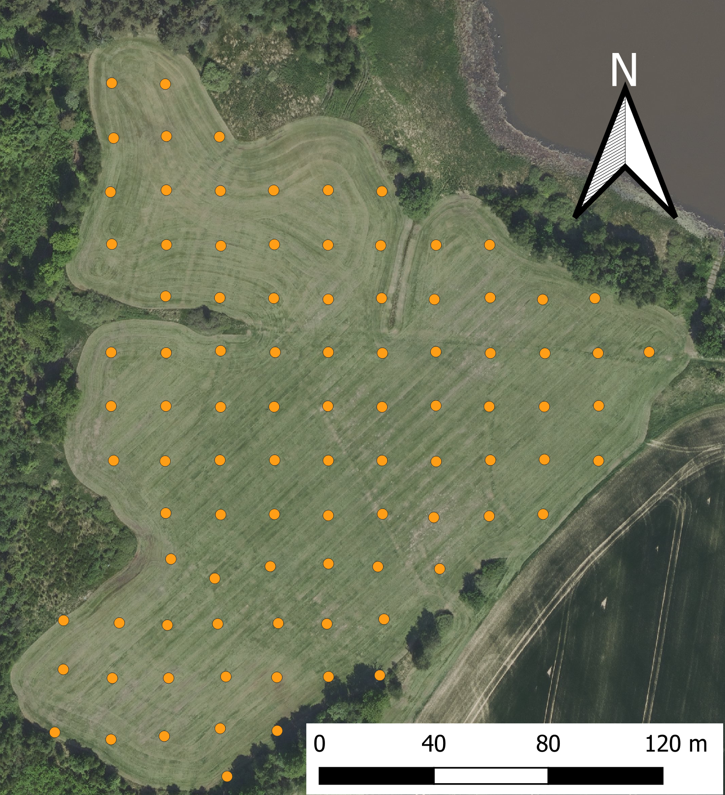
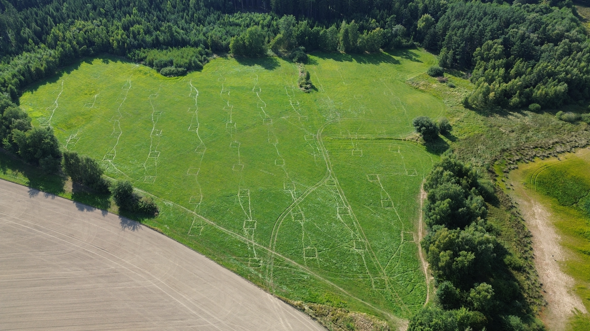
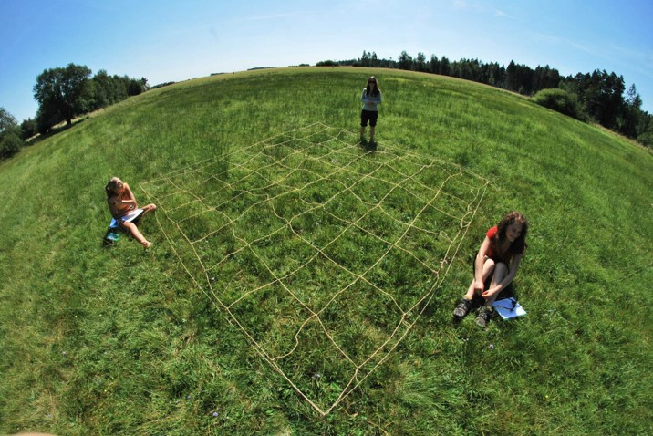
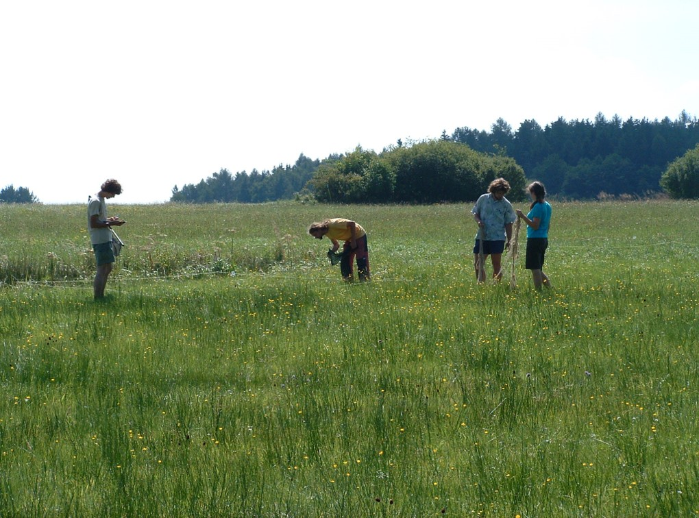
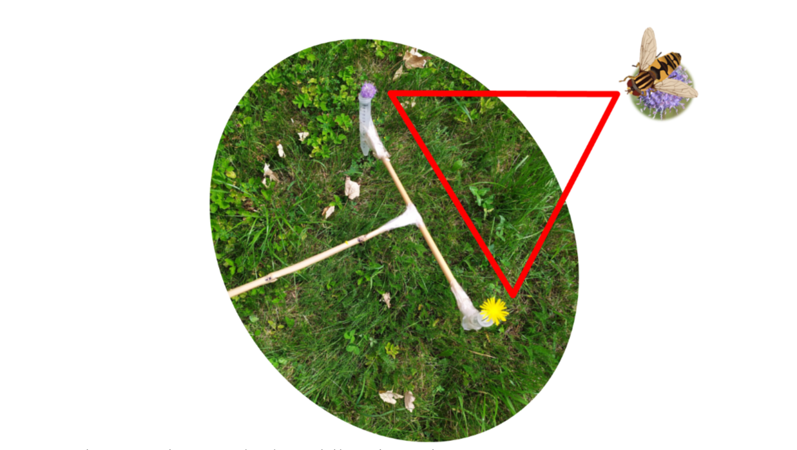
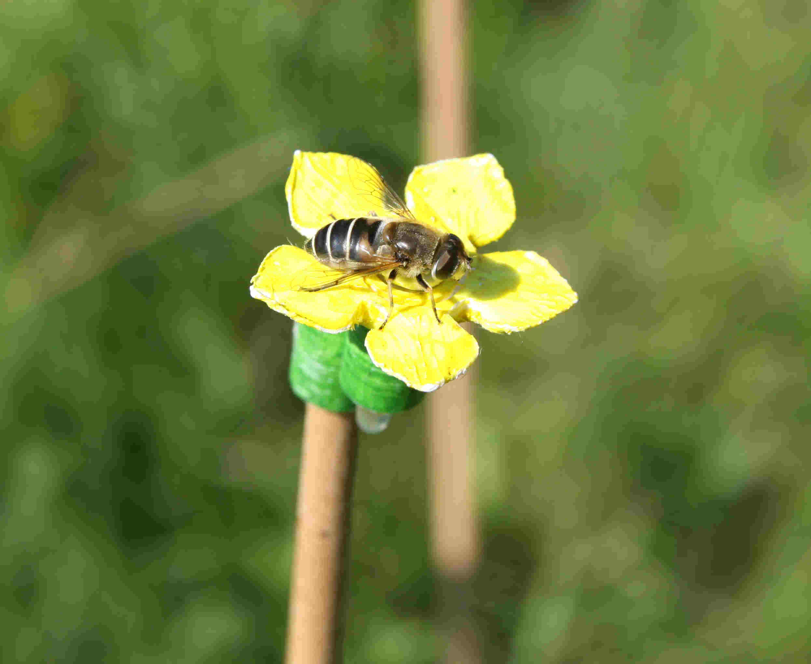

::: {.column-screen}

<video class="hero-video" autoplay loop muted playsinline style="width: 100%; height: 100%; object-fit: cover; position: absolute; top: 0; left: 0;">
  <source src="videos/video_intro_reduced_shorter.mp4" type="video/mp4" />
</video>

:::

::: {style="display: block; margin: 0 auto; max-width: 1100px; padding: 20px; background-color: white; position: relative; z-index: 10;"}

Opylovači Handrkov

Vítejte na stránce k terénnímu výzkumu na louce k Handrkovu! Zde najdete všechny relevantní informace ohledně našeho výzkumu, kontakty a praktické informace k organizaci letošního ročníku. 

## Smysl a cíle {#mise}

Cílem výzkumu opylovačů na Handrkově je zkoumat nastavení vztahů mezi rostlinami, jejich opylovači a parazity opylovačů. K tomu nám pomáhá série pokusů, z nichž některé běží už od roku 2011. Dlouhodobým cílem je pak zjistit, jak stabilní jsou tyto vztahy a co je může na takové obyčejné louce ovlivňovat.  

Dalším cílem celé akce je ale umožnit setkání lidí, kteří mají zájem o terénní výzkum, chtějí se dozvědět jak výzkum může fungovat a můžou se setkat s širší skupinou lidí, kteří tyto zájmy sdílejí. Klademe si za cíl vytvářet prostředí, které inspiruje a dodává nadšení. Doufáme, že se to daří.  

## Praktické informace
### Shrnutí 

- 📍 **kde**: [Handrkov (49.8463442N, 15.1504281E) u obce Vernýřov](https://mapy.com/s/bajutotaca) 
- 📅 **kdy**: Od 10. do 25. srpna 2026, s horkou fází od 15. do 25. srpna
- 👥 **kdo**: Vítán je kdokoliv se zájmem o zapojení se do výzkumu opylovačů! Vše naučíme!
- 🍎 **jídlo**: Vaříme společně, jídlo zajistíme i pro vegetariány a vegany. Vlastní lahev na pití a ešus je výhodou.
- 🚗 **doprava**: Na úseku Uhlířské Janovice nebo Zbraslavice dopravu zajistíme. Pište na [+420 774 553 734](tel:+420774553734)
- ⛺ **bydlení**: Pod plachtou, případně ve vlastních stanech.
- ✉️ **kontakt**: [Jakub Štenc](mailto:jakubstenc@gmail.com)
- 📝 **připoj se**: [Pro snazší organizaci se prosím zapište do tabulky. Přidejte i potravní omezení pro plán nákupu potravy.](https://docs.google.com/spreadsheets/d/1ePI0sPdLbW1OV9V6SF3Zo9zAx_xZIR8kcXzYUY-UEqU/edit?usp=sharing)

<iframe style="border:none" src="https://mapy.com/s/mahuzecema" width="500" height="333" frameborder="0"></iframe>

Výzkum opylovačů na louce k Handrkovu bude probíhat od 10. do 25. srpna, s "horkou fází" přibližně od 15. do 25. srpna, účastnit se lze na libovolně dlouhou podmnožinu času, jen je pro nás lepší vědět o účasti dopředu. [Proto prosím doplňte své jméno do této tabulky (měla by jít upravovat, kdyby, tak napište).](https://docs.google.com/spreadsheets/d/1ePI0sPdLbW1OV9V6SF3Zo9zAx_xZIR8kcXzYUY-UEqU/edit?usp=sharing) Tabulka není závazná a jde do ní určitě vyplnit i "možná". Jde nám ale hlavně o získání přehledu ohledně možného nasazení lidských zdrojů na různé pokusy a jednak o nákup potravy a zajištění vody. A také prosím připojte poznámku o potravních omezeních prosím.
Budeme na louce k Handrkovu (49.8463442N, 15.1504281E) u obce Vernýřov studovat interakce mezi hmyzem a rostlinami a to sérii pokusů, přičemž část jich poběží již třináctým rokem. Zajišťujeme stravu a dopravu z nejbližšího městečka (Uhlířské Janovice nebo Zbraslavice, záleží na směru příjezdu). Bydlíme přímo na louce pod velkou plachtou, vaříme společně na ohni a novinkou posledních let je malá solární sprcha se zástěnou. Byť jsou podmínky lehce spartánské, je to o to lepší zážitek (a můžeme díky tomu provádět pokusy hned od rána do večera, bez potřeby se přesouvat).
Oceníme jakoukoliv pomoc a vše potřebné zaučíme! S sebou je pak potřeba jen oblečení, něco na hlavu (úpal je nejčastější problém), vlastní lahev na pití (vodu zajišťujeme centrálně, ale aby měl člověk jednu lahev pro vlastní spotřebu) a věci na spaní venku (od rybníka je občas lehce chladněji, tak je lepší být připraven). Obecně bereme i nějaké vidličky a misky na jídlo, ale pro zvýšenou schopnost kompetice doporučuji mít s sebou vidličku/lžičku, nůž a misku - občas je nás víc než vidliček a hůř se pak kompetuje (ale hlad nebývá).

{fig-align="center" width="650"}

## Přidej se! {#pridejse}

Přidat se může opravdu každý člověk dobré vůle! 
Není potřeba mít předchozí znalosti rostlin nebo živočichů, vše potřebné naučíme. 
Je akorát potřeba počítat se spaním venku/ve stanu a dlouhodobým pobytem na sluníčku. 

[Pro snazší organizaci se prosím zapište do tabulky. Přidejte i potravní omezení pro plán nákupu potravy.](https://docs.google.com/spreadsheets/d/1ePI0sPdLbW1OV9V6SF3Zo9zAx_xZIR8kcXzYUY-UEqU/edit?usp=sharing)

### Plakát

{width=80% fig-align="center" .border .rounded .shadow-sm}

  <a href="images/Plakat/2026/Poster2026.pdf" class="btn btn-primary" role="button" download>
    <i class="bi bi-file-earmark-pdf"></i> Stáhnout plakát (PDF)
  </a>

## Galerie {#galerie}

## Kontakt {#kontakt}

- 📧 **E-mail**: [Jakub Štenc](mailto:jakubstenc@gmail.com)
- 📞 **Telefon**: [Jakub Štenc](tel:+420774553734)
- 💬 **WhatsApp**: [Jakub Štenc](https://wa.me/420774553734)
- 📸 **Instagram**: [opylovaci_handrkov_](https://www.instagram.com/opylovaci_handrkov_/)
- 🎙️ **Podcast**: [Spotify](https://open.spotify.com/show/3ypxSzPMkd4TOepn3oTrVl), [YouTube](https://www.youtube.com/@opylovaci_podcast)

## Informace k pokusům:

Letos plánujeme sérii pokusů, přičemž hlavní pokus "jiné čtverce" spočívá v pozorování interakcí v soustavě cca 96 permanentních ploch o rozměrech 4*4 metru. Dále pak budeme sbírat blizny z rostlin, na kterých pak v laboratoři budeme určovat deponovaná pylová zrna, protože nás zajímá, mezi kterými druhy dochází k nechtěnému přenosu pylu. Pak budeme zkoumat, kolik pylu odnáší a přináší opylovači na bliznu za jednu návštěvu, kolik nesou pylu na těle. V dalším pokusu budeme pokračovat ve sběru dat ohledně rozhodování opylovačů při výběru, na který květ raději létají (pokusu říkáme vidle, jde o párový rozhodovací test). Nově pak budeme zkoušet hledat trypanozómy ve střevech pestřenek (pod vedením Šimona Zemana) a trochu staro/nově budeme dělat pokusy s umělými květy v pokusných klecích (to je ale ještě pořád lehce nejisté). Dále pak chceme letos zkusit metodiku na pozorování nočních opylovačů a to jak svícením na plátno, tak obcházením louky s červenou čelovkou. Uvidíme jak se to vydaří!

### Jiné čtverce

Jiné čtverce je pokus, který běží od roku 2011 a umožňuje nám nahlížet změny mezi vztahy opylovačů a rostlin mezi roky. K tomu nám slouží 96 trvalých ploch o rozměrech 4*4 metru, které jsou umístěny na louce v pravidelné síti.

{fig-align="center" width="650"}

{fig-align="center" width="650"}

Každý čtverec je trvale označen a musí se každý rok dohledat pomocí minohledačky. Poté v nich počítáme množství kvetoucích rostlin a zaznamenáváme interakce s jejich opylovači.

{fig-align="center" width="650"}

{fig-align="center" width="650"}

Ve výsledku pak vidíme síť vztahů mezi rostlinami a opylovači a vidíme její proměny mezi jednotlivými roky.

### Blizny

V rámci sítě vztahů nás nezajímá jenom jak opylovači navštěvují rostliny, ale také jak to vede k přenosu pylu mezi rostlinami. Protože většina rostlin sdílí své opylovače s ostatními druhy rostlin, je zajímavé sledovat, jakým způsobem se přenos pylu mezi rostlinami projeví: je úplně ekvivalentní tomu, jak opylovači navštěvují rostliny nebo jsou některé rostliny které svůj pyl přenášejí na jiné rostliny častěji než bychom mohli očekávat na základě sítě návštěv? Které rostliny to jsou? 

V rámci tohoto experimentu budeme sbírat blizny na nichž později v laboratoři určíme přenesený pyl.   

{fig-align="center" width="650"}

### Vidle 

V rámci vztahů mezi opylovači a rostlinami je zajímavé sledovat, jakým způsobem opylovači rozhodují, na který květ raději létají. Abychom ale mohli odstínit vliv rozmístění rostlin v prostoru, nabízíme opylovačům vždy dva květy na dlouhé tyčce se dvěma ampulkama s vodou a květy. Tomuto nástroji říkáme "vidle". Pak stačí dva květy nabídnout opylovači na květu a zaznamenat si, pro který květ se rozhodl. 

{fig-align="center" width="650"}

### Trypanozómy

Na naší louce K Handrkovu studujeme trypanozómy a další parazity v střevech pestřenek. Zajímá nás předně, které druhy trypanozóm se vyskytují  ve střevech opylovačů a jak si je opylovači mezi sebou předávají. Tuto část výzkumu vede Šimon Zeman z katedry Parazitologie. 

### Umělé květy

V rámci preferencí a chování opylovačů nás zajímá, které vlastnosti květů dokáží změnit rozhodnutí opylovačů a případně které vlastnosti jsou důležitější než jiné. Je to snad barva? Velikost? Nebo tvar? Může to být ale i postavení květu v rámci květenství nebo i výška květu. Abychom lépe porozuměli opylovačům a jejich náladám, používáme umělé květy, u kterých můžeme přesně manipulovat jejich podobou a tím sledovat, které vlastnosti mají na opylovače vliv. Letos budeme s těmito pokusy pokračovat a uvidíme, co za výsledky přinesou.

{fig-align="center" width="350"}

### Noční opylovači

Letos plánujeme zkusit novou metodiku na pozorování nočních opylovačů a to jak svícením na plátno, tak obcházením louky s červenou čelovkou a nahrávání pomocí kamer s nočním viděním. Uvidíme jak se to vydaří!

## Další čtení o výzkumu opylovačů na Handrkově

[Vztahy rostlin a opylovačů na louce (článek v časopise Živa)](https://ziva.avcr.cz/files/ziva/pdf/vztahy-rostlin-a-opylovacu-na-louce-aneb-nejen-bot.pdf)

:::

## Opylovačské setkání 2026 - III. ročník

